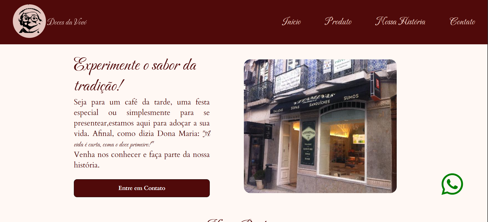

# 🍬 Doces da Vovó — Aplicação FullStack para Competição Senac



---

## 🏷️ Badges


---

## 📝 Resumo do Projeto

O **Doces da Vovó** é uma aplicação **fullstack** desenvolvida como preparação para a **Competição Senac de Educação Profissional**, simulando uma loja de doces fictícia que precisava de presença digital.  
O projeto contempla **design**, **frontend**, **backend**, **banco de dados**, **validação de formulários** e **boas práticas de segurança**, resultando em uma solução completa e funcional.

---

## 📚 Índice

- [Introdução](#-introdução)
- [Demonstração](#-demonstração)
- [Design](#-design)
- [Arquitetura do Sistema](#-arquitetura-do-sistema)
- [Decisões de Desenvolvimento](#-decisões-de-desenvolvimento)
- [Funcionalidades](#-funcionalidades)
- [Tecnologias Utilizadas](#-tecnologias-utilizadas)
- [Requisitos](#-requisitos)
- [Guia de Instalação](#-guia-de-instalação)
- [Referências](#-referências)

---

## 🚀 Introdução

Este projeto foi desenvolvido com o objetivo de **treinar e simular um cenário real** para participação na **Competição Senac de Educação Profissional**.  
A proposta foi criar uma **aplicação fullstack** capaz de resolver problemas de uma **loja de doces fictícia** que não possuía site.

### Problemas abordados
- Ausência de presença digital  
- Falta de identidade visual  
- Inexistência de canal de contato com clientes  

### Solução
Foi criada uma aplicação com **identidade visual própria** e as seguintes páginas:
- **Índice**: apresentação dos produtos  
- **Nossa História**: história da marca e sua tradição  
- **Contato**: localização via iframe e formulário de contato funcional  

---

## 🔗 Demonstração

- 🌐 **Deploy (Vercel)**:  
  > ⚠️ *A demonstração no Vercel não inclui o processamento em PHP nem o banco de dados SQL.*

👉 **Link**: *[https://doces-da-vovo.vercel.app/]*

---

## 🎨 Design

O design do projeto foi planejado antes do desenvolvimento, utilizando **wireframe e sitemap no Figma**.

- 🔗 **Figma**: *[https://www.figma.com/proto/PCEw7zcyWOh1kaEDE44g9w/doces-da-vovo?node-id=0-1&t=lWHReIhxQuHIVOcW-1]*  

### 🎨 Paleta de cores
- `#fff8f4`
- `#bb826d`
- `#500a0a`

### 🔤 Tipografia (Google Fonts)
- **Caráter** — títulos e textos de destaque  
- **Cardo** — textos corridos  

---

## 🏗️ Arquitetura do Sistema

O projeto segue uma arquitetura **simples e organizada**, adequada a aplicações educacionais fullstack:

- **Frontend**: HTML5, CSS3 e JavaScript  
- **Backend**: PHP  
- **Banco de Dados**: MySQL  
- **Ferramentas**: XAMPP (servidor local) e Figma (design)

O fluxo consiste em:
1. Usuário acessa o site
2. Preenche o formulário
3. Dados são validados no frontend
4. Backend processa e salva no banco de dados

---

## 🔐 Decisões de Desenvolvimento

### 1️⃣ Sanitização de Dados
- Redução de riscos de ataques maliciosos
- Padronização da entrada de dados
- Maior confiabilidade das informações

### 2️⃣ Proteção contra XSS
- `htmlspecialchars()` para converter caracteres especiais
- `strip_tags()` para remover tags HTML e PHP
- Evita execução de scripts maliciosos

### 3️⃣ Proteção contra SQL Injection
- Uso de **consultas preparadas**
- Separação entre comando SQL e dados
- Aumento da segurança do banco de dados

---

## ⚙️ Funcionalidades

### 🏠 Página Índice
- Apresentação dos produtos
- Destaque visual da marca


---

### 📖 Nossa História
- História da marca
- Valorização da tradição

---

### 📬 Contato
- Iframe com localização
- Formulário de contato com validação


---

## 🧰 Tecnologias Utilizadas

| Categoria     | Tecnologia     | Versão | Propósito no Projeto                     | Justificativa |
|--------------|---------------|--------|-------------------------------------------|--------------|
| Frontend     | HTML5          | —      | Estrutura das páginas                     | Padrão web   |
| Frontend     | CSS3           | —      | Estilização e responsividade              | Flexibilidade|
| Frontend     | JavaScript     | —      | Validação e interatividade                | Dinamismo    |
| Backend      | PHP            | —      | Processamento do formulário               | Simples e eficaz |
| Banco de Dados | MySQL        | —      | Armazenamento dos dados                   | Popular e confiável |
| Ferramentas  | XAMPP          | —      | Servidor local                            | Facilidade   |
| Design       | Figma          | —      | Wireframe e layout visual                 | Colaboração  |

---

## 📋 Requisitos

- XAMPP instalado  
- Navegador atualizado  
- Conhecimentos básicos em:
  - HTML
  - CSS
  - JavaScript
  - PHP
  - SQL  

---

## 🛠️ Guia de Instalação

### 1️⃣ Clonar o repositório

Clone o projeto dentro da pasta do XAMPP:

```bash
git clone https://github.com/gi-alves/doces-da-vovo
```

### 2️⃣ Configurar o Banco de Dados

Acesse o phpMyAdmin:
```bash
http://localhost/phpmyadmin
```

- Crie o banco de dados:

Nome: formulario

Execute o SQL:
```bash
CREATE TABLE `tb_contato` (
  `nome` varchar(100) NOT NULL,
  `email` text NOT NULL,
  `mensagem` text NOT NULL,
  `id_contato` int(11) NOT NULL
);
```
---

## 📚 Referências

- Documentação PHP
- MySQL Docs
- Google Fonts
- Figma

---

Desenvolvido por Galves-gi

Criado em 2025
